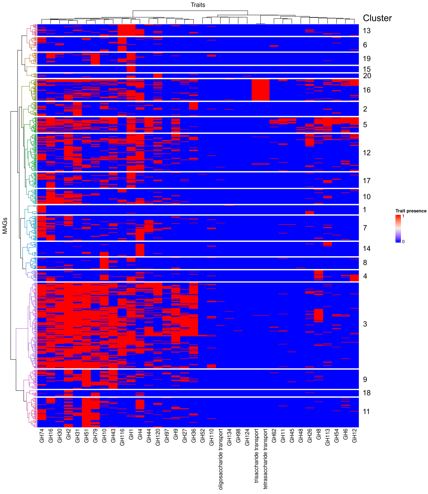

```{r setup, include=FALSE}
knitr::opts_chunk$set(echo = TRUE)
```

```{r load_libs, warning=FALSE, message=FALSE}
packages <- c("R.utils", "RColorBrewer", "ape", "assertthat", "checkmate",
              "coRdon", "corrplot", "dendextend", "devtools", "doParallel", 
              "dplyr", "factoextra", "formatR", "futile.logger", "ggplot2", 
              "grid", "gtools", "kmed", "lazyeval", "magrittr", "parallel", 
              "pheatmap", "readr", "stringr", "tibble", "tictoc", "tidyr", "vegan")
for (pkg in packages) {
  library(pkg, character.only=TRUE)
}

# bioconductor packages
library(BiocManager)
library(Biostrings)
library(ComplexHeatmap)
library(coRdon)

# everything else
library(gRodon)
library(pairwiseAdonis)
library(EcolUtils)
library(ggtree)
library(microtrait)
```

```{r load_data}
load("data/traits.RData")
```

This file steps through the hierarchical clustering and subsequent heatmap generation process.

```{r clustering}
set.seed(1) #set randomness seed

# assign row names for cluster labeling
bw_gh_transport_cl <- bw_gh_transport[, 1:37]
row.names(bw_gh_transport_cl) <- paste(bw_gh_transport$id, bw_gh_transport$Class, sep = ": ")
bw_gh_transport_cl <- bw_gh_transport_cl[, !(names(bw_gh_transport_cl) %in% c('id', 'Class'))]

# pare down transport trait names 
names(bw_gh_transport_cl) <- sub("Resource Acquisition:Substrate uptake:carbohydrate transport:", "", names(bw_gh_transport_cl))
names(bw_gh_transport_cl) <- sub("^oligosaccharide transport:", "", names(bw_gh_transport_cl))

dist.1 <- vegdist(bw_gh_transport_cl, method = "jaccard", binary = TRUE)
dist.2 <- vegdist(t(bw_gh_transport_cl), method = "jaccard", binary = TRUE)
clust.1 <- hclust(dist.1, method="ward.D2")
clust.2 <- hclust(dist.2, method="ward.D2")
mat <- as.matrix(bw_gh_transport_cl)

# render dendrogram
row_dend = as.dendrogram(clust.1)
row_dend = color_branches(row_dend, k = 20) # `color_branches()` returns a dendrogram object
```

```{r heatmap, eval = FALSE}
ppi <- 250
png("heatmap_gh_transport_class.png", width=12*ppi, height=105*ppi, res=ppi)

Heatmap(
  mat,
  name = "GH gene and transport trait detection in MAGs",
  heatmap_legend_param = list(
    at = seq(0, 1, by = 1),
    title = "Trait presence"),
  cluster_rows = row_dend,
  cluster_columns = clust.2,
  show_row_names = TRUE,
  show_column_names = TRUE,
  column_title = "Traits",
  row_title = "Bin ID + Class",
  column_names_max_height = max_text_width(
    colnames(mat), 
    gp = gpar(fontsize = 12)
  ),
  row_dend_width = unit(2, "cm"),
  row_split = 20,
  row_gap = unit(0.5, "cm")
)

dev.off()
```


The above code chunk renders the full-size heatmap, complete with bin IDs and classes. The chunk below renders a downsized version without labels; this version was included in the thesis document. Cluster labels and asterisks indicating significance were added afterward following differential abundance analysis.

```{r heatmap_small, eval = FALSE}
# thumbnail ver. of heatmap for thesis
ppi <- 250
png("heatmap_gh_transport_class_thumb.png", width=12*ppi, height=15*ppi, res=ppi)

Heatmap(
  mat,
  name = "GH gene and transport trait detection in MAGs",
  heatmap_legend_param = list(
    at = seq(0, 1, by = 1),
    title = "Trait presence"),
  cluster_rows = row_dend,
  cluster_columns = clust.2,
  show_row_names = FALSE,
  show_column_names = TRUE,
  column_title = "Traits",
  row_title = "MAGs",
  column_names_max_height = max_text_width(
    colnames(mat), 
    gp = gpar(fontsize = 12)
  ),
  row_dend_width = unit(2, "cm"),
  row_split = 20
)

dev.off()
```

