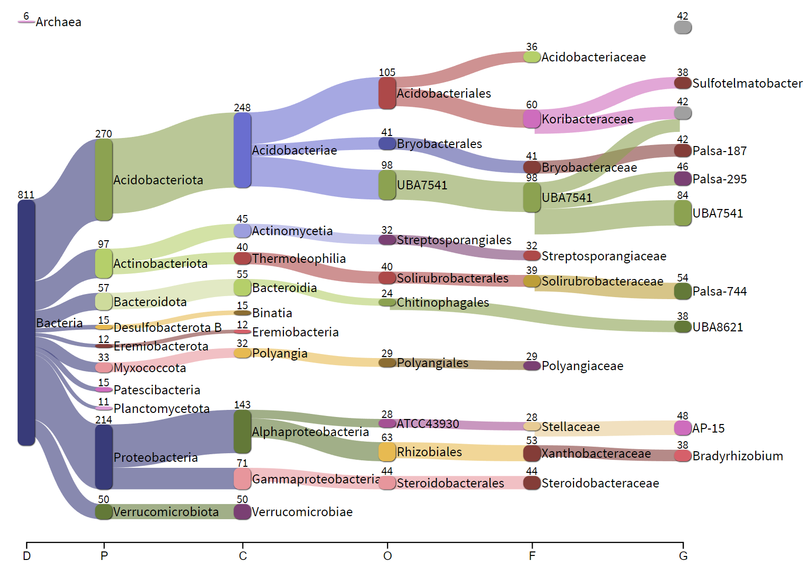

```{r setup, include=FALSE}
knitr::opts_chunk$set(echo = TRUE)
```

```{r}
library(tidyverse)
```

This file walks through the process to generate a Sankey visualization of the metagenomes using the information outputted by MetaBAT. Thanks to Professor Blanchard for providing the starting code. 

# Pavian Sankey Plot

* [Pavian Github](https://github.com/fbreitwieser/pavian)
* Upload the resulting file to [Pavian Shiny](https://fbreitwieser.shinyapps.io/pavian/)
* Generate html report
* Click on Sample then Configure sankey
* Adjust the graph and the save network
* Caitlin Singleton used a html to svg converter (https://www.hiqpdf.com/demo/ConvertHtmlToSvg.aspx) with aesthetic tweaks in inkscape. * Pavian doesn't do empty species or genus names (e.g. g__s__). Delete those fields in the file or in inkscape. To show them, create denovo genera and species names so they are unique and cluster appropriately.

## Make input for for Pavian Sankey Plot (from GTDB format)

```{r}
BW_coassembly_GTDB <- read_tsv("data/metaG_coassembly_all_metabat.tsv")  %>% 
  select('Bin ID', Domain, Phylum, Class, Order, Family, Genus) %>%
  mutate_at('Domain', ~paste0("d__", .)) %>% 
  mutate_at('Phylum', ~paste0("|p__", .)) %>%
  mutate_at('Class', ~paste0("|c__", .)) %>%
  mutate_at('Order', ~paste0("|o__", .)) %>%
  mutate_at('Family', ~paste0("|f__", .)) %>%
  mutate_at('Genus', ~paste0("|g__", .)) %>%
  unite(col=classification, Domain, Phylum, Class, Order, Family, Genus, sep = "") %>% 
  mutate_at("classification", str_replace_all, "NA", "") 

BW_coassembly_GTDB_s <- BW_coassembly_GTDB
BW_coassembly_GTDB_g <- BW_coassembly_GTDB
BW_coassembly_GTDB_f <- BW_coassembly_GTDB
BW_coassembly_GTDB_o <- BW_coassembly_GTDB
BW_coassembly_GTDB_c <- BW_coassembly_GTDB
BW_coassembly_GTDB_p <- BW_coassembly_GTDB
BW_coassembly_GTDB_d <- BW_coassembly_GTDB
BW_coassembly_GTDB_id <- BW_coassembly_GTDB

BW_coassembly_GTDB_g$classification <- sub("\\|s__.*", "", BW_coassembly_GTDB_g$classification)  
BW_coassembly_GTDB_f$classification <- sub("\\|g__.*", "", BW_coassembly_GTDB_f$classification)  
BW_coassembly_GTDB_o$classification <- sub("\\|f__.*", "", BW_coassembly_GTDB_o$classification)  
BW_coassembly_GTDB_c$classification <- sub("\\|o__.*", "", BW_coassembly_GTDB_c$classification)  
BW_coassembly_GTDB_p$classification <- sub("\\|c__.*", "", BW_coassembly_GTDB_p$classification)  
BW_coassembly_GTDB_d$classification <- sub("\\|p__.*", "", BW_coassembly_GTDB_d$classification) 

BW_coassembly_GTDB_allTaxa <- bind_rows(BW_coassembly_GTDB_s, BW_coassembly_GTDB_g, BW_coassembly_GTDB_f, BW_coassembly_GTDB_o, BW_coassembly_GTDB_c, BW_coassembly_GTDB_p, BW_coassembly_GTDB_d) %>% 
  mutate(classification = as.factor(classification)) %>% 
  count(classification) %>% 
# rename for Pavian format
  rename(`#SampleID` = `classification`) %>% 
  rename(`Metaphlan2_Analysis` = `n`)
```

```{r}
write_tsv(BW_coassembly_GTDB_allTaxa, "data/BW_coassembly_GTDB_pavian.txt")
```

```{r}
write_tsv(BW_coassembly_GTDB, "data/BW_coassembly_GTDB_with_ID.tsv")
```

[Interactive HTML file with Pavian Sankey Plot for BW filter metagenomes](sankey-BW_coassembly_GTDB_pavian.html)

