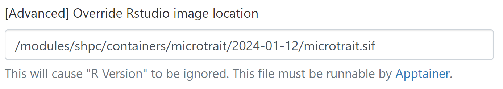
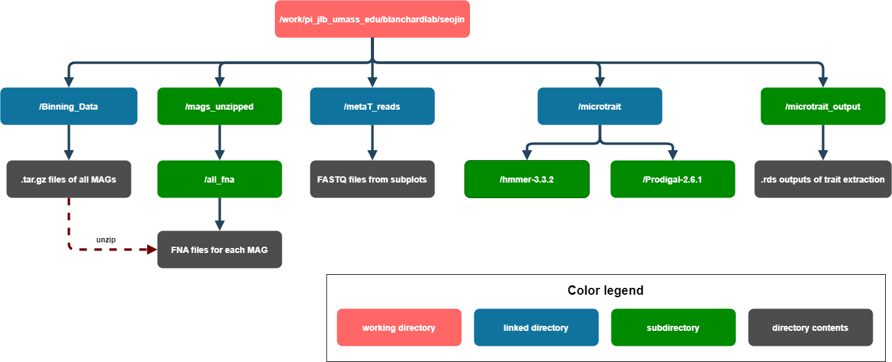

```{r setup, include=FALSE}
knitr::opts_chunk$set(echo = TRUE)
```

This file discusses my setup process for running microTrait and subsequent analyses.

# Loading the microTrait container in RStudio

The best way to use microTrait in RStudio on the Unity server is to load the provided container. This simplifies setup and makes running the code more reliable. There are two ways to load the container:

1.  **Unity OnDemand RStudio**

    When preparing to launch an RStudio session, paste [/modules/shpc/containers/microtrait/2024-01-12/microtrait.sif]{style="color: deeppink;"} into the "[Advanced] Override RStudio image location" field.

    

2.  **Unity terminal or batch script**

    The container can also be loaded as a module:

    ```{bash load_mod, eval = FALSE}
    module use /modules/shpc/views/x86_64
    module load microtrait/2024-01-12
    ```

Thanks to Dr. Georgia Stuart at UMass Amherst IT for her aid in setting up the microTrait container.

# Installing dependencies

These chunks only need to be run once when running this file for the first time, with the exception of the first chunk, which is used later to load the relevant libraries.

```{r packages, message=FALSE, warning=FALSE}
# list of R packages
list_of_packages = c("R.utils", "RColorBrewer", "ape", "assertthat", "checkmate",
                      "coRdon", "corrplot", "dendextend", "devtools", 
                     "doParallel", "dplyr", "factoextra", "formatR", "futile.logger",
                     "ggplot2", "grid", "gtools", "kmed", "lazyeval", "magrittr", 
                     "parallel", "pheatmap", "readr", "stringr", "tibble", "tictoc", 
                     "tidyr", "vegan")
```

Installation:

```{r install, eval = FALSE}
newpackages <- list_of_packages[!(list_of_packages %in% installed.packages()[,"Package"])]
if(length(new.packages)) install.packages(newpackages)

# install BiocManager
if (!require("BiocManager", quietly = TRUE))
  install.packages("BiocManager")
BiocManager::install(version = "3.18")

# install bioconductor packages
if (!requireNamespace("BiocManager", quietly = TRUE))
  install.packages("BiocManager")
BiocManager::install("Biostrings")
BiocManager::install("coRdon")
BiocManager::install("ComplexHeatmap")
BiocManager::install("ggtree")

# install gRodon
devtools::install_github("jlw-ecoevo/gRodon")

# install pairwiseAdonis
install_github("pmartinezarbizu/pairwiseAdonis/pairwiseAdonis")

# install EcolUtils
devtools::install_github("GuillemSalazar/EcolUtils")

# install microtrait
devtools::install_github("ukaraoz/microtrait")
```

# Load and configure

## Prelude: Directory organization

If you are running the code in this document, please take care to note that the code depends on a specific directory organization. Thus, file paths may need to be modified for different setups. Here is a (simplified) visual guide to how my directory is set up:



## Load libraries

Here, we load the necessary libraries using the `list_of_libraries` created in the first code chunk. Other libraries that needed to be installed separately are also loaded separately. Libraries may need to be reloaded at the start of every session.

```{r load_libs, message=FALSE, warning=FALSE}
# r packages
for (pkg in list_of_packages) {
  library(pkg, character.only=TRUE)
}


# bioconductor packages
library(BiocManager)
library(Biostrings)
library(ComplexHeatmap)
library(coRdon)

# everything else
library(gRodon)
library(pairwiseAdonis)
library(EcolUtils)
library(ggtree)
library(microtrait)
```

## Set PATH

It may be necessary to specify paths for HMMER and Prodigal to run microTrait. This chunk should only need to be run once, and only if an error occurs without it. If you are running microTrait in the container, this step should not be necessary at all.

```{r set_path, eval = FALSE}
Sys.setenv(PATH = paste("microtrait/hmmer-3.3.2/src", Sys.getenv("PATH"), sep = ":"))
Sys.setenv(PATH = paste("microtrait/Prodigal-2.6.1", Sys.getenv("PATH"), sep = ":"))
```

## Download and deploy HMM models

Again, this should only need to be run once after microTrait installation. The directory accessed here is located in the user's home directory on Unity, but the code should be able to find it on its own.

```{r prep_hmm, eval = FALSE}
microtrait::prep.hmmmodels()
list.files(file.path(.libPaths(), "microtrait/extdata/hmm/hmmpress"))
```
